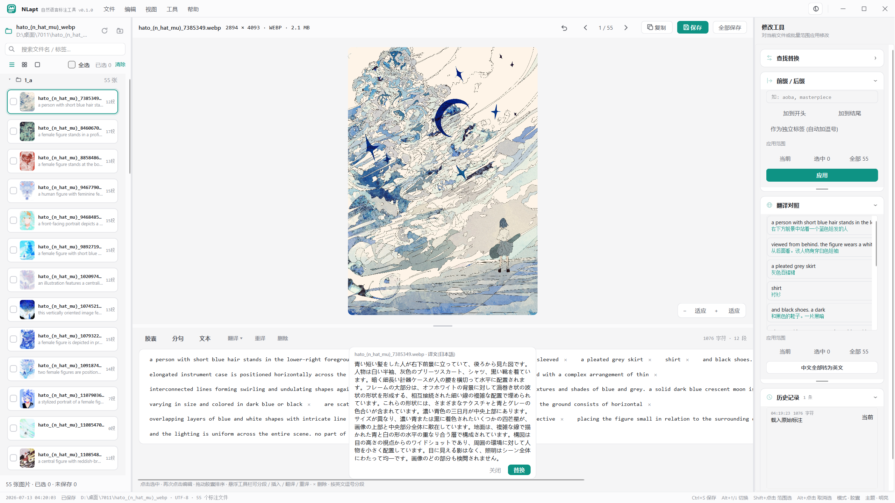
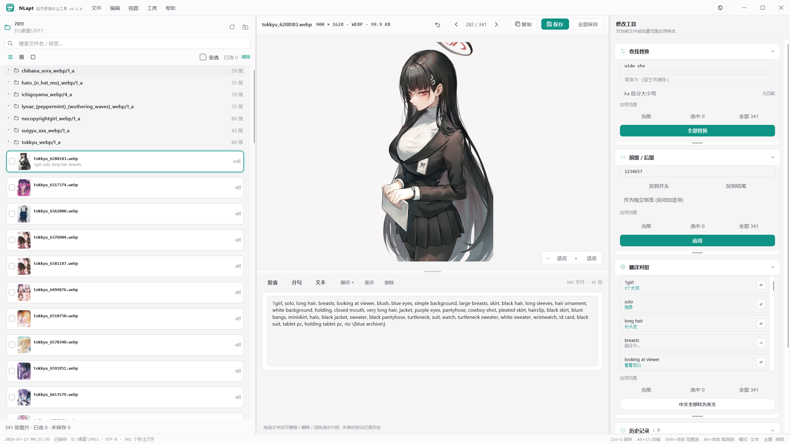
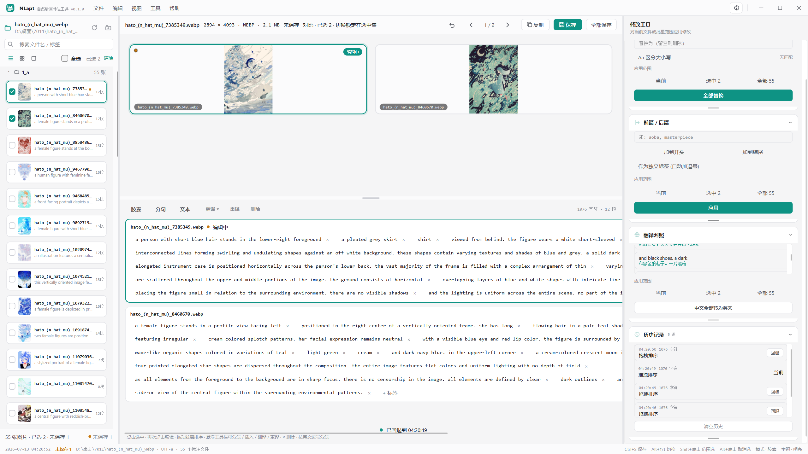
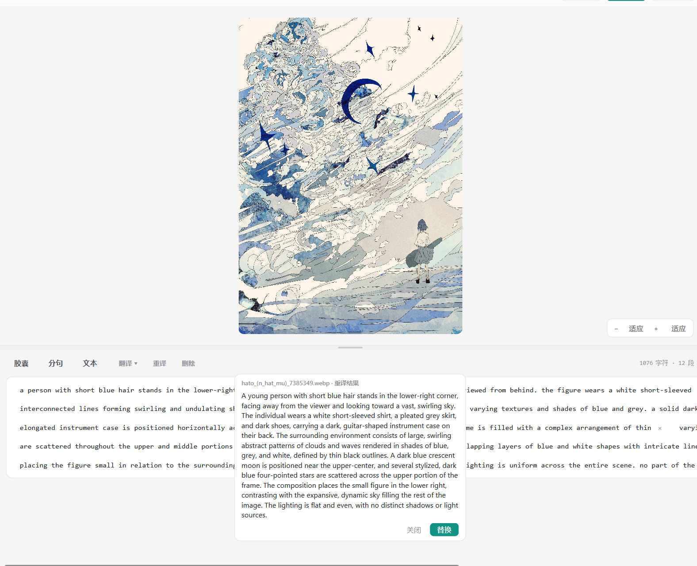
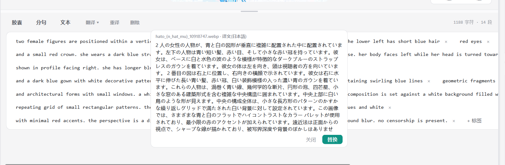
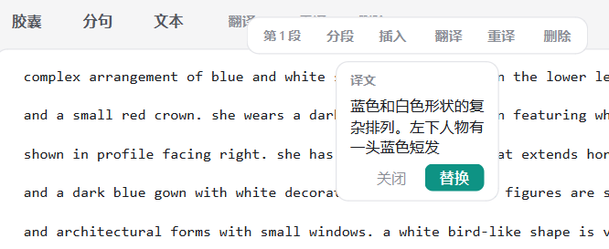
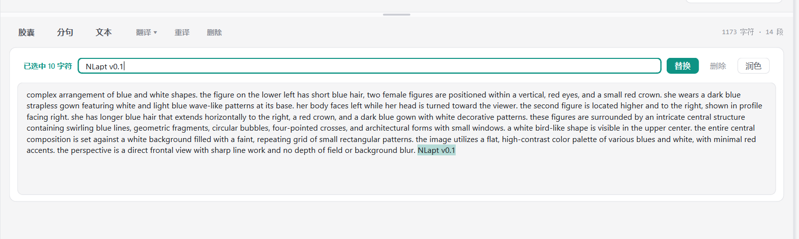
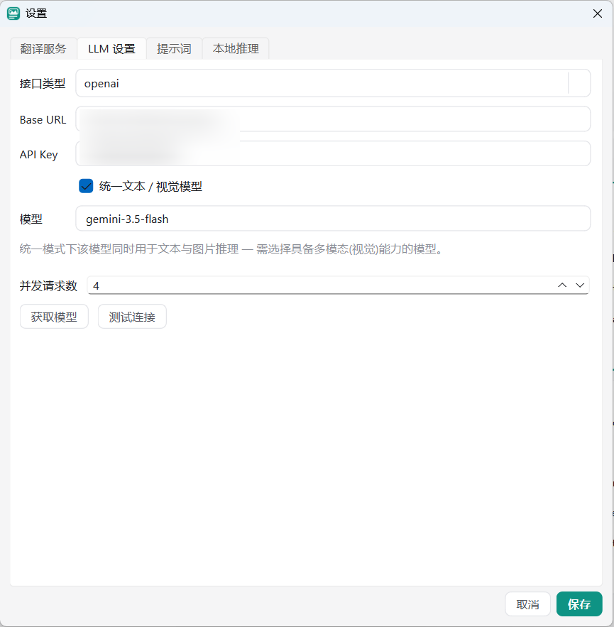

# NLapt — 自然语言标注工具

**NLapt**(Natural Language Annotation Processing Tools)是一款面向**自然语言标注(caption)处理**的图文标注编辑器——适用于 LoRA / 图像生成模型训练集制作、图文数据集清洗等任何需要批量编辑图像描述文本的场景:左栏浏览数据集、中栏预览与编辑 caption、右栏批量修改工具,深度集成 LLM(批量生成、重写、翻译、视觉推理),并以"任何批量操作可预览、可回滚"为底线设计。

NLapt is a desktop editor for natural-language image captions — for training-set curation (LoRA / image-generation models), dataset cleaning, or any workflow that pairs images with `.txt` descriptions. It combines keyboard-first editing, safe batch operations (automatic snapshots + rollback), and deep LLM integration (translate / rewrite / vision captioning). UI language: Chinese.

- **平台**:Windows 优先,跨平台(Python 3.11+ / PySide6)
- **数据格式**:「图片 + 同名 `.txt`」—— danbooru 标签与自然语言可混排,兼容 kohya 目录结构

## 界面预览



| | |
|---|---|
|  列表视图 · 文件夹分组 · 翻译对照 |  多选对比编辑 · 历史记录回退 |
|  图片推理:LLM / 本地模型重新推理整张图片 |  整篇标注翻译(中 / 英 / 日) |
|  悬浮工具栏锚定在片段上方 · 片段翻译 |  文本模式:选区替换 / 删除 / 润色 |

<p align="center"><br>设置 · LLM:统一/分离 文本与视觉模型 · 并发 · 一键获取模型列表</p>

## 功能特性

### 编辑

- **三种编辑模式**:胶囊(标签逐个拖拽排序 / 点击选中、再次点击编辑)、分句(逐段行编辑)、文本(自由编辑 + 选区 替换 / 删除 / 润色)。
- **悬浮工具栏**:出现在选中片段正上方,支持 分段 / 插入 / 翻译 / 重译 / 删除。
- **标注工作区**:对整篇标注一键 **翻译**(中 / 英 / 日 互换)、**LLM 推理 / 本地推理**(用在线视觉模型或本地模型重新推理图片,生成全新标注)、**删除**;「删除」右侧 **译文** 把当前标注译成中文并常驻显示在编辑器底部(不替换原文)。编辑区右上角常驻 `字符 · 段 · 约 N tokens · M 词`。
- **分层推标**:右键菜单「分层推标」走人物卡 + 画面描述两段式向导(点选参考图、候选卡、token/词预览),最终标注为「外貌服装卡 + 空行 + 姿态场景」。
- **多选对比**:最多 4 张图片并排预览与编辑,Shift 范围选 / Alt 取消选。
- **逐文件历史**:每一步修改都有带标签的历史记录,可随时回退;Ctrl+Z 撤销。

### LLM 与翻译

- **接口**:OpenAI / Anthropic / Ollama 兼容 API,可分别配置文本模型与视觉模型,或勾选"统一模型"共用一个多模态模型。
- **获取模型**:一键拉取当前 API 的可用模型列表,自动标记疑似多模态模型,点选填入。
- **翻译服务**:大模型翻译或内置 Google / 百度 / DeepL 翻译 API,自由切换;译文按内容缓存,相同标签只请求一次。
- **自定义提示词**:为图片推理配置系统提示词模板(新建 / 保存 / 删除 / 导出)与用户提示词;在线 LLM 与本地模型默认**统一管线**共用同一套,也可为本地推理单独设置。
- **翻译对照**:右栏显示原文与译文(分段 / 整段两种对照方式,长句描述用整段更通顺),一键"中文全部转为英文"。
- 全部网络与磁盘操作异步执行,界面零阻塞;并发数可在设置中调整。

### 本地推理

- **内置模型目录**:Gemma 4 全系列(E2B / E4B / 12B / 26B-A4B MoE / 31B)、Heretic 无审查衍生版、动漫标注特化 **ToriiGate 0.5** 与写实标注 **JoyCaption Beta One**——均选自 HuggingFace 下载量最高的公开 GGUF 仓库(目录快照 2026-07-20),按「大系列 ▸ 小系列 ▸ 量化档」分层展示,标注体积与热度。
- **能否运行预测**:自动检测 CPU / 内存 / NVIDIA 显存,对每个量化档按所选上下文长度给出五级中文评级——**轻松运行 / 流畅运行 / 可以运行 / 勉强能跑 / 跑不动**,附占用明细(权重 / 视觉组件 / 上下文 / 开销)与显存内存预算。
- **应用内下载 + 模型复用**:断点续传、实时进度、可取消;完成后按 HuggingFace 官方 SHA256 指纹校验完整性;视觉模型自动附带 mmproj 组件。下载目录默认在程序目录内(`models/`),可自定义,并支持添加多个「复用目录」直接使用其它工具已下载的同款 GGUF,不重复下载。
- **内置 llama.cpp 运行时,就绪即可用**:程序自带完整推理能力——首次下载模型 / 启动服务时自动获取固定版本的官方 llama-server(SHA256 指纹校验;Windows 采用 Vulkan 构建,NVIDIA / AMD / Intel 显卡通用,无 Vulkan 时自动回退 CPU),也可手动指定自己的可执行文件。模型下载完成即可直接点「本地推理」,无需任何额外步骤;上下文长度 / GPU 层数 / 线程 / **并发请求数** / 端口均可配置。
- **一键切换**:「设为当前模型」把翻译 / 重译 / 批量 AI 操作立即切到本地模型,完全离线、无需 API Key。
- **Florence-2 LoRA**:官方 / PromptGen ONNX 支持 PEFT LoRA 合并;目录内置可下载 LoRA,也可自选 safetensors。

### 批量推标

- **文件夹右键推标**:在左栏右键任意文件夹(或顶部 **ALL** 行)即可对 **此文件夹 / 已选 / 全部** 图片批量生成标注,LLM 与本地模型两条通道任选。
- **文件夹多选**:每个文件夹标题带三态复选框,一键选中整个文件夹;顶部 ALL 行全选,组合出任意处理范围。
- **模型只加载一次**:本地批量推理全程复用同一 llama-server 实例,推理结束后保持加载、**空闲 30 秒无新请求才卸载**(手动启动的服务永不自动卸载),绝不逐张加载 / 卸载;并发数跟随「并发请求数」设置。
- **全程可控**:执行前确认并自动快照(事后可在历史记录整批回滚),状态栏实时显示进度,右键随时取消;取消后重新开始会从断点续跑,已完成的不重推。

### 批量与数据安全

- **查找替换 / 前缀后缀**:实时命中统计,作用域 当前 / 选中 / 全部;"独立标签"模式自动防触发词重复。
- **自动快照**:任何批量操作前自动把全部 txt 打包为 zip 快照(默认保留 20 份),可整体回滚,回滚本身也可反悔。快照与崩溃恢复会话写在 `%APPDATA%\NLapt\datasets\` 下,不再污染数据集目录。
- **原子写入**:临时文件 + rename,写入中断不损坏标注;统一 UTF-8(无 BOM)落盘,自动检测并提示转换 GBK 等编码。
- **崩溃恢复**:未保存草稿实时写入会话文件,崩溃或断电后重开自动恢复。

### 界面

- 无边框自绘窗口,五套主题(明亮 / 雾灰 / 石墨 / 深邃 / 墨黑)+ **色彩设置**(预设主题色或任意自定义取色)。
- 窗口与全部子窗口居中出现、淡入淡出过渡;状态栏常驻保存状态、快捷键提示与实时时钟。

## 快速开始

### 方式一:一键脚本(Windows)

双击 [`Launch-NLapt.bat`](Launch-NLapt.bat) —— 自动检查 Python 与依赖(缺失时自动安装)并启动。

### 方式二:pip

```powershell
pip install -e .[gui,images,llm,local]   # PySide6 + Pillow + httpx + onnxruntime
python -m nlapt_gui                      # 或安装后使用 nlapt-gui 命令
```

启动后经「文件 ▸ 打开文件夹…」选择数据集根目录,下次启动自动重开上次目录。

### 配置 LLM(可选)

「工具 ▸ 设置…」:

1. **翻译服务**:选择大模型或 Google / 百度 / DeepL(后两者需自行注册密钥)。
2. **LLM 设置**:填写接口类型、Base URL、API Key 与模型;「获取模型」可直接拉取可用模型列表;「测试连接」验证配置。
3. **提示词**:为图片推理配置系统 / 用户提示词,支持模板管理与导出;默认在线与本地统一管线,可为本地推理单独设置。
4. **本地推理**:在目录中选择模型量化档(附「能否运行」评级)→ 下载(自动附带 llama.cpp 运行时)→ 完成后即可在编辑区或文件夹右键使用「本地推理」。

设置、日志、LLM 配置以及每个数据集的快照 / 会话 / 断点保存在 `%APPDATA%\NLapt`(可用环境变量 `NLAPT_DATA_DIR` 覆盖)。打开旧数据集时会把残留的 `.backups/`、`.nlapt/` 一次性迁走。

## 快捷键

| 快捷键 | 功能 |
|---|---|
| `Ctrl+S` / `Ctrl+Shift+S` | 保存当前 / 全部保存 |
| `Ctrl+Z` | 撤销(焦点在输入框时为输入框自身撤销) |
| `Alt+↑` / `Alt+↓` | 上一张 / 下一张 |
| `Shift+点击` / `Alt+点击` | 范围多选 / 取消选择 |

## 打包发布

```powershell
Build-NLapt.bat        # 或: python -m PyInstaller packaging/nlapt.spec --noconfirm
```

产出 `dist/NLapt/NLapt.exe`(onedir、无控制台,约 200 MB;已排除误打包的 torch / CUDA / paddle)。应用图标为 `packaging/icon.ico`,直接替换该文件即可换图标。详见 [`packaging/README.md`](packaging/README.md)。

## 开发

### 架构

```
nlapt/        核心库(无 UI 依赖):storage 原子写/扫描/快照 · captions 标注仓库
              · ops 文本操作 · llm 客户端/翻译/重写/视觉 · batch 批量引擎
              · history 撤销/操作日志 · workflow diff/审核 · app.py NLaptApp 门面
              · local 本地推理(模型目录/硬件检测/兼容性预测/下载/llama-server/内置运行时)
nlapt_gui/    PySide6 界面:controller.py 为 UI 与核心的唯一桥梁,
              widgets/ 各面板 · theme/ 主题令牌与 QSS(无硬编码颜色)
tests/        与源码镜像的 pytest 套件(离屏运行,不联网、不真实等待)
```

架构与接口约定见 [`docs/ARCHITECTURE.md`](docs/ARCHITECTURE.md)(核心库)与 [`docs/UI_ARCHITECTURE.md`](docs/UI_ARCHITECTURE.md)(界面);完整功能需求见 [`NLapt.md`](NLapt.md)。

### 运行测试

```powershell
python -m pytest -q                                   # 全量
python -m pytest tests/gui -q                         # 仅 GUI(离屏,无需显示器)
python -m pytest --cov=nlapt --cov=nlapt_gui -q       # 覆盖率
```

核心库零第三方依赖;可选 `httpx`(LLM)、`Pillow`(图片)、`PySide6`(GUI)、`pytest` / `pytest-cov`(测试)。

### 作为核心库使用

界面之外,`nlapt` 可独立作为标注处理库使用 —— 依赖 `NLaptApp` 门面与事件总线即可:

```python
from pathlib import Path
from nlapt import NLaptApp
from nlapt.core.events import EVT_CAPTION_CHANGED, EVT_BATCH_PROGRESS

app = NLaptApp(log_dir=Path("logs"))
app.bus.subscribe(EVT_CAPTION_CHANGED, lambda e: print(e.payload))
app.bus.subscribe(EVT_BATCH_PROGRESS,  lambda e: print(e.payload))

app.open_dataset(root)                       # 扫描 + 载入 + 建索引 + 会话恢复
app.edit(key, text); app.undo(key)           # 编辑(自动维护索引与撤销栈)
report = app.apply_operation(op, keys, description="批量替换")  # 快照 → 执行 → 日志
report = app.run_caption_batch(keys, captioner, description="推标")  # 视觉批量推标(可并发)
app.rollback_operation(op_id)                # 从操作日志整体回滚
app.close()                                  # 退出前保存脏文件与会话
```

### 扩展点

| 扩展点 | 位置 | 用法 |
|---|---|---|
| `OperationRegistry` | `nlapt.ops.base` | `registry.register("my_op", factory)` 注册新文本操作 |
| `CLIENT_REGISTRY` | `nlapt.llm.base` | `register_client("my_api", factory)` 接入新 LLM 提供商 |
| `TokenEstimator` | `nlapt.captions.tokens` | 实现 `estimate(text) -> int` 替换 token 估算器 |
| `EventBus` | `nlapt.core.events` | `subscribe(name_or_None, handler)` 订阅单个或全部事件 |
| 模板系统 | `nlapt.llm.templates` | `TemplateStore` 自定义提示词模板 |

## 许可

[MIT](LICENSE)
