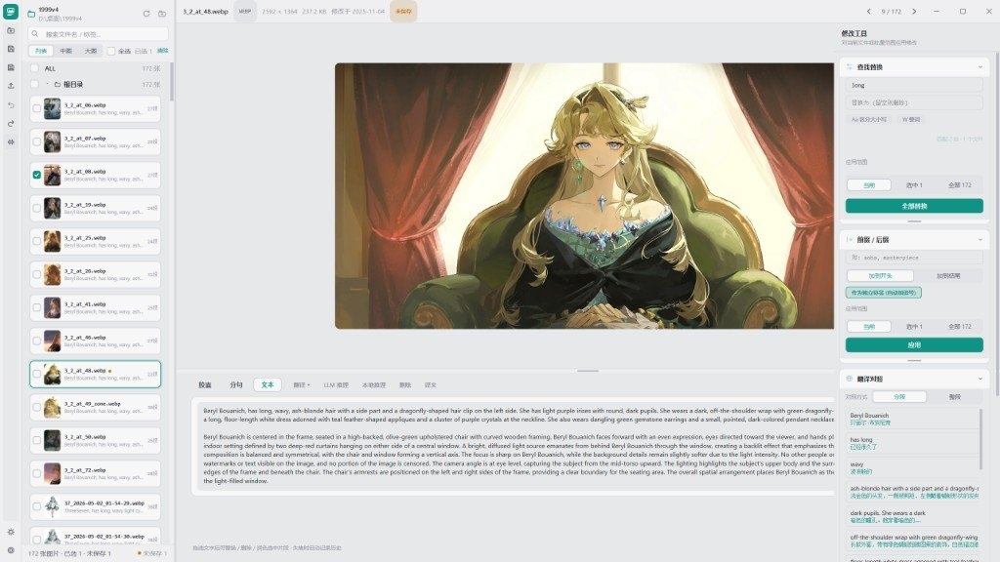
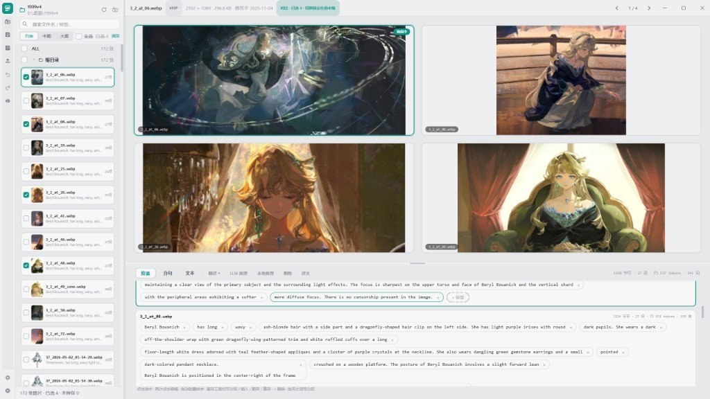
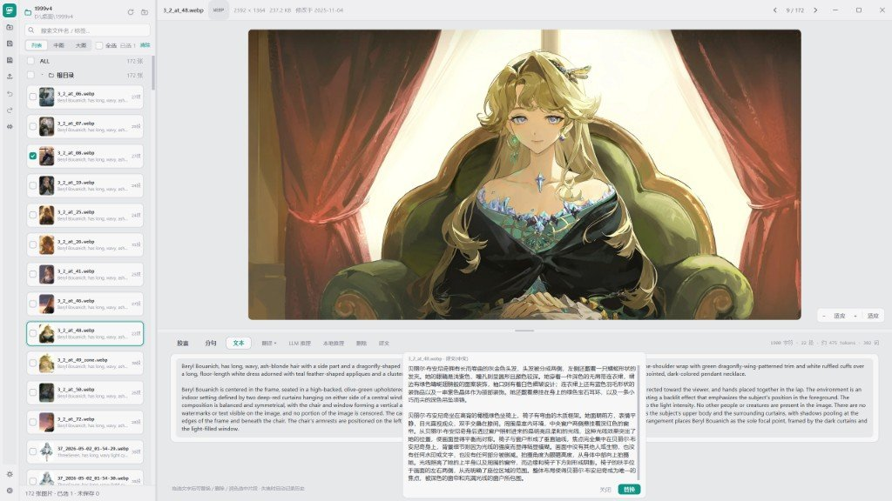
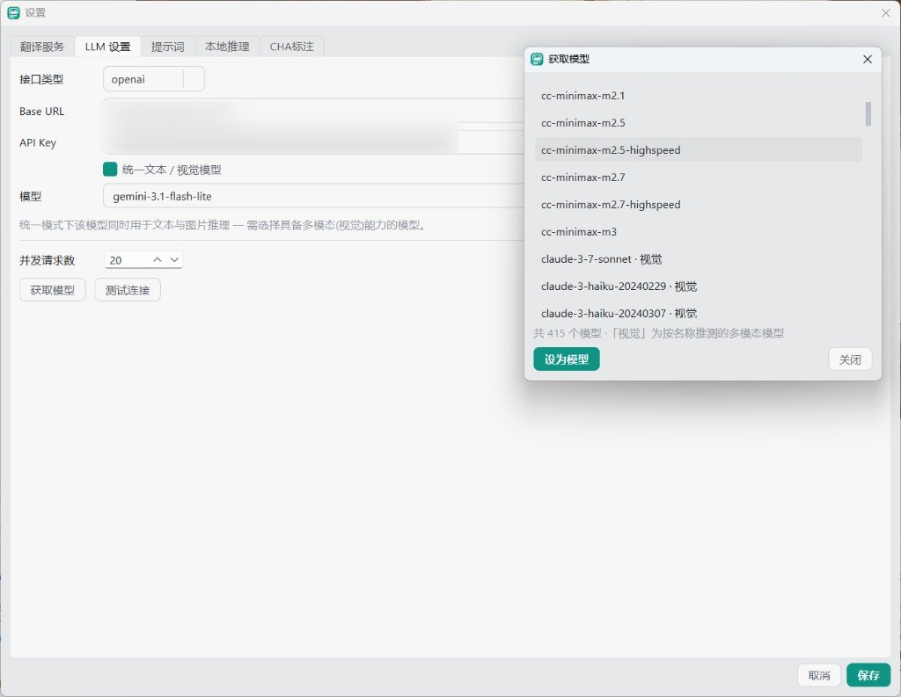
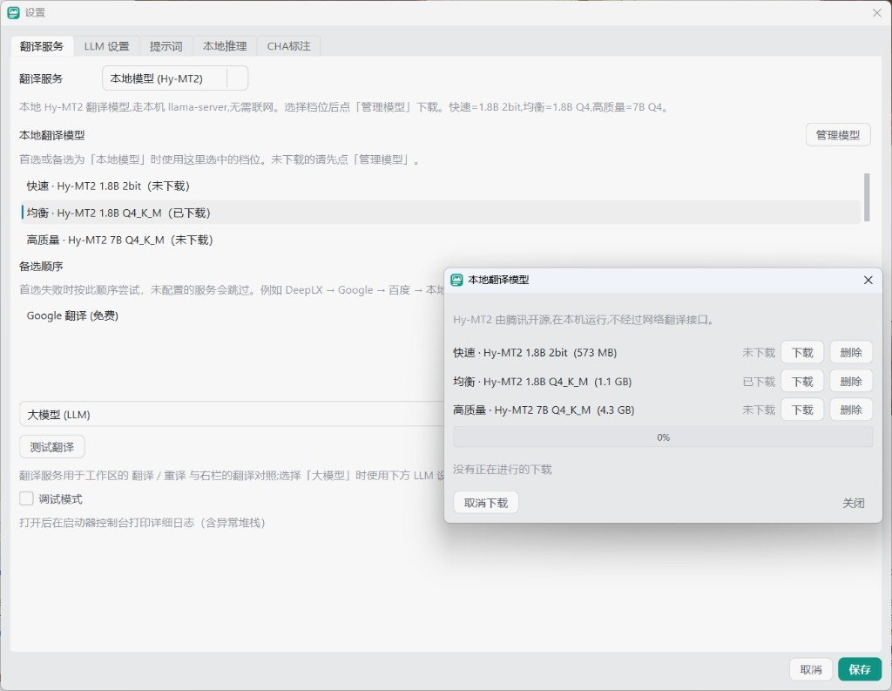
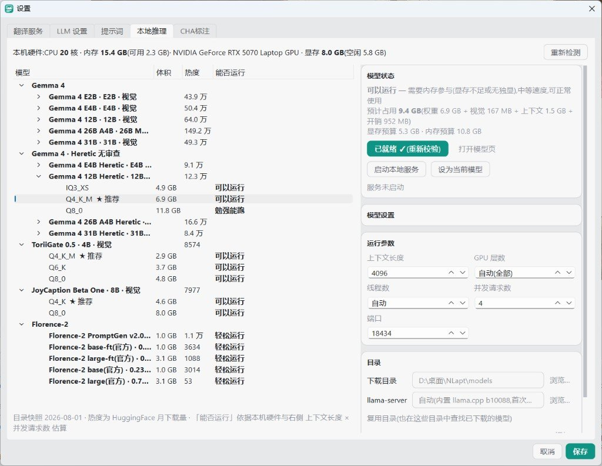

<div align="center">

# NLapt

**自然语言标注工具** · Natural Language Annotation Processing Tools

面向图像生成与 LoRA 训练的桌面标注编辑器：处理「图片 + 同名 `.txt`」，单张精修，批量可回滚。


[](https://nasa-ammos.github.io/slim/)

</div>

界面为中文。Windows 优先，其它平台可用 Python 3.11+ / PySide6。数据格式兼容 kohya 子目录；danbooru 标签与自然语言可混排。标注只在显式保存时写入磁盘。

[功能清单](docs/功能清单.md) · [架构约定](docs/ARCHITECTURE.md) · [界面约定](docs/UI_ARCHITECTURE.md) · [更新说明](docs/更新日志.md) · [Issue](https://github.com/storyAura/NLapt/issues)

## 界面预览

<table>
<tr>
<td><br><em>主界面：左栏文件、中栏编辑、右栏工具</em></td>
<td><br><em>最多 4 张并排对比</em></td>
</tr>
<tr>
<td><br><em>整篇中 / 英 / 日翻译对照</em></td>
<td><br><em>设置 · LLM 档案</em></td>
</tr>
<tr>
<td><br><em>设置 · 翻译通道与备选</em></td>
<td><br><em>设置 · 本地模型目录</em></td>
</tr>
</table>

## Features

- **三种编辑模式**：胶囊 / 分句 / 文本；悬浮工具栏可分段、插入、翻译、重译、删除
- **整篇工作**：中 / 英 / 日翻译，LLM 或本地模型重新推标；最多 4 张多选对比
- **CHA标注**（组合分层推标）：先锁定人物卡，再整批只写姿态与场景；可同步主 LLM 或单独接口，三个方案与整批画面可各选模型
- **翻译通道**：大模型、Google、百度、DeepL、DeepLX、本机 Hy-MT2；首选失败按备选顺序继续
- **本地推理**：GGUF 目录、五级「能否运行」、应用内下载与 SHA256 校验；Florence-2 可挂 LoRA
- **数据安全**：批量前自动 zip 快照并可整批回滚；未保存草稿崩溃后可恢复

更细的操作说明见 [功能清单](docs/功能清单.md)。

## Contents

* [界面预览](#界面预览)
* [Features](#features)
* [Quick Start](#quick-start)
* [Configuration](#configuration)
* [Changelog](#changelog)
* [FAQ](#frequently-asked-questions-faq)
* [Contributing](#contributing)
* [License](#license)
* [Support](#support)

## Quick Start

### Requirements

- Python 3.11+
- Windows 推荐；其它平台需自行安装 PySide6 等依赖
- 在线功能需要 LLM / 翻译接口；本地推标需要磁盘空间以下载 GGUF 或 Florence 权重

### Setup Instructions

**方式一（Windows）**

1. 双击 [`Launch-NLapt.bat`](Launch-NLapt.bat)
2. 脚本会检查 Python 与依赖，缺失时自动安装

**方式二（pip）**

```powershell
pip install -e .[gui,images,llm,local]
```

可选依赖：`gui` = PySide6，`images` = Pillow，`llm` = httpx，`local` = onnxruntime / numpy。开发再加 `,dev`。

### Run Instructions

```powershell
python -m nlapt_gui
```

或安装后使用 `nlapt-gui`。启动后经「文件 ▸ 打开文件夹…」选择数据集根目录；下次启动会重开上次目录。

### Usage Examples

- 左栏浏览与多选，中栏编辑 caption，右栏查找替换 / 前缀后缀。
- 「工具 ▸ 设置…」配置翻译服务、LLM、提示词、本地推理、CHA标注。
- 左栏右键可对文件夹 / 已选 / 全部做 LLM 或本地推标，或打开 CHA标注向导。

常用快捷键：`Ctrl+S` 保存当前，`Ctrl+Shift+S` 全部保存，`Alt+↑` / `Alt+↓` 换图，`Shift+点击` 范围选。

核心库也可单独调用：

```python
from pathlib import Path

from nlapt import NLaptApp

app = NLaptApp(log_dir=Path("logs"))
scan = app.open_dataset(Path(r"D:\dataset"))
app.edit(scan.images[0].key, "a girl, standing")
app.close()
```

### Build Instructions

```powershell
Build-NLapt.bat
```

产出 `dist/NLapt/NLapt.exe`（onedir、无控制台）。应用图标为 `packaging/icon.ico`。详见 [packaging/README.md](packaging/README.md)。

### Test Instructions

```powershell
python -m pytest -q
python -m pytest tests/gui -q
python -m pytest --cov=nlapt --cov=nlapt_gui -q
python -m ruff check nlapt nlapt_gui tests
```

GUI 测试离屏运行，不需要显示器。套件不访问真实网络、不使用真实 sleep。

## Configuration

| 位置 | 内容 |
|---|---|
| `%APPDATA%\NLapt`（`NLAPT_DATA_DIR` 可覆盖） | 主题、通道选择、提示词、本地模型设置、缩略图缓存、日志 |
| 文档\NLapt\api.json（`NLAPT_DOCUMENTS_DIR` 可覆盖「文档」根） | LLM 档案、翻译通道、CHA 独立接口的类型 / 地址 / 密钥 / 模型名 |

第一次启动若还没有 `api.json`，会把旧版散落的密钥迁过去并清掉残留。密钥不进数据集目录。

## Changelog

近期面向使用者的改动见 [docs/更新日志.md](docs/更新日志.md)。接口级约定写在 [docs/ARCHITECTURE.md](docs/ARCHITECTURE.md) 与 [docs/UI_ARCHITECTURE.md](docs/UI_ARCHITECTURE.md) 的版本附录。

发布记录见 [Releases](https://github.com/storyAura/NLapt/releases)。

## Frequently Asked Questions (FAQ)

1. **CHA标注和普通推标有什么区别？**  
   普通推标直接为每张图生成整段标注。CHA标注先锁定一套人物卡，再为每张图只写姿态与场景，最终拼成「人物卡 + 空行 + 画面段」。
2. **Florence-2 能做 CHA标注吗？**  
   不能。Florence-2 只走指令模式，不支持自定义提示词，请改用 LLM。
3. **配置和密钥存在哪里？**  
   应用数据在 `%APPDATA%\NLapt`。全部接口配置在「文档\NLapt\api.json」。详见 [Configuration](#configuration)。
4. **批量操作会弄坏数据集吗？**  
   执行前会把全部 txt 打成 zip 快照（默认保留 20 份），可在历史记录整批回滚。快照写在 `%APPDATA%\NLapt\datasets\`，不放进数据集目录。

## Contributing

1. 在 [Issues](https://github.com/storyAura/NLapt/issues) 说明要改什么
2. [Fork](https://github.com/storyAura/NLapt/fork) 本仓库
3. 在自己的 fork 里修改，并补上对应测试
4. 提交 Pull Request，约定使用 Conventional Commits（`feat:` / `fix:` / …）

首次参与可参考：[How to Contribute to an Open Source Project on GitHub](https://kcd.im/pull-request)

本地请保持 `python -m pytest -q` 与 `python -m ruff check nlapt nlapt_gui tests` 通过。代码与注释用英文，用户可见文案用中文。

## License

[MIT](LICENSE)。Copyright (c) 2026 storyAura。

## Support

维护者：[storyAura](https://github.com/storyAura)

问题与功能请求请开 [Issue](https://github.com/storyAura/NLapt/issues)。
